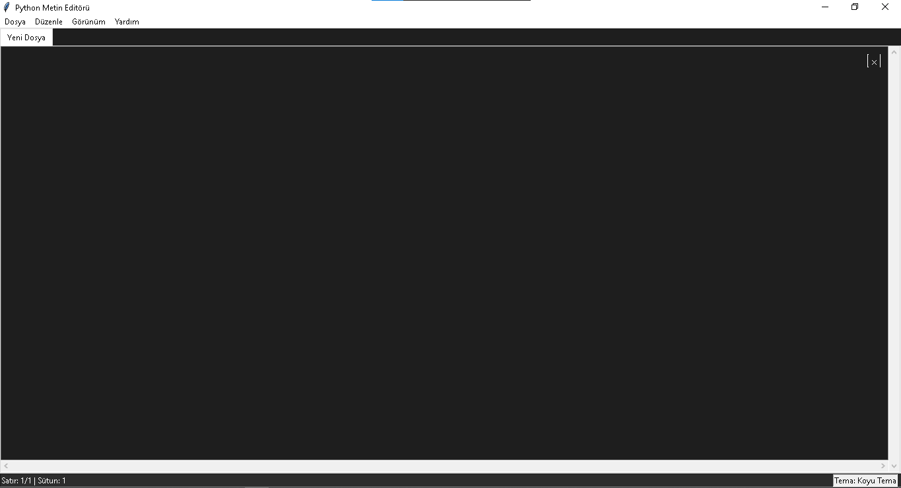
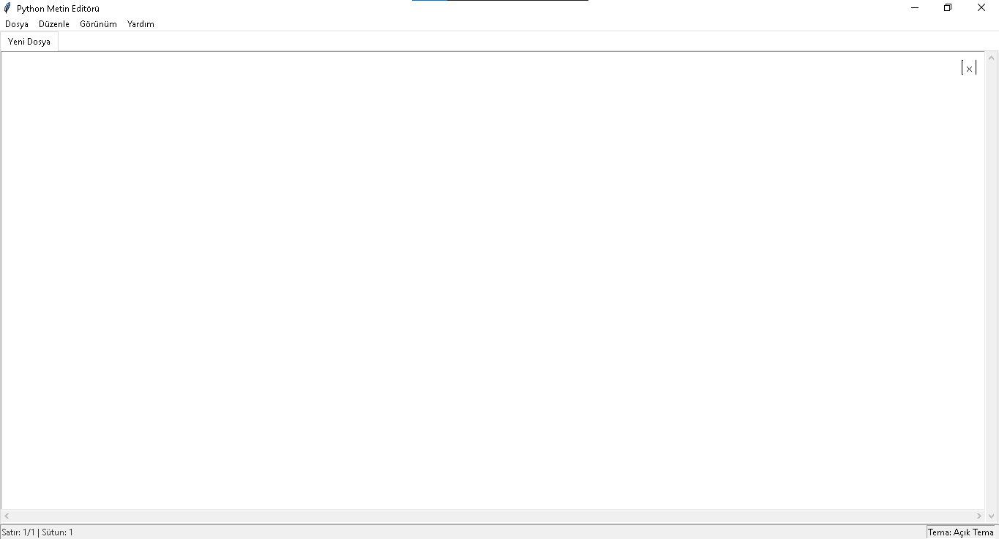
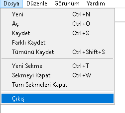
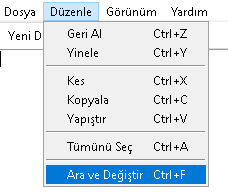
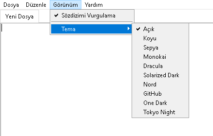

# 🖋️ Modern Metin Editörü

Bu proje, Python ve Tkinter kullanılarak geliştirilmiş modern ve kullanıcı dostu bir metin editörüdür.

🖼️ 

### 📸 Ekran Görüntüleri

#### 🌞 Beyaz Tema


#### 📁 Dosya Sekmesi


#### ✏️ Düzenle Sekmesi


#### 👁️ Görünüm Sekmesi


#### ❓ Yardım Sekmesi


## ✨ Özellikler

- 🎨 Çoklu tema desteği (Açık/Koyu tema)
- 📑 Çoklu sekme desteği
- 🔍 Gelişmiş arama ve değiştirme özellikleri
- 📝 Sözdizimi vurgulama desteği:
  - 🐍 Python
  - 🌐 HTML
  - 🎨 CSS
  - 📜 JavaScript
  - 📦 JSON
  - 📄 XML
  - 📝 Markdown
- 🎯 Otomatik parantez eşleştirme
- 📊 Performans izleme ve raporlama
- 🖱️ Sürükle-bırak sekme yönetimi
- 📱 Tam ekran desteği
- 🔄 Dosya değişikliklerini otomatik izleme
- 💾 Otomatik kaydetme ve değişiklik kontrolü
- ⌨️ Klavye kısayolları desteği

## 📋 Gereksinimler

- 🐍 Python 3.x
- 🖥️ Tkinter (Python ile birlikte gelir)
- 💻 platform (Python ile birlikte gelir)

## 🚀 Kurulum

1. 📥 Projeyi klonlayın:
```bash
git clone https://github.com/Memati8383/metin-editorum.git
```

2. 📂 Proje dizinine gidin:
```bash
cd metin-editorum
```

3. ▶️ Uygulamayı çalıştırın:
```bash
python editor.py
```

## 📖 Kullanım

### 🔧 Temel İşlemler
- 📄 Yeni Dosya: `Ctrl + N`
- 📂 Dosya Aç: `Ctrl + O`
- 💾 Kaydet: `Ctrl + S`
- 💾 Farklı Kaydet: `Ctrl + Shift + S`
- 💾 Tümünü Kaydet: `Ctrl + Alt + S`

### ✂️ Düzenleme
- ↩️ Geri Al: `Ctrl + Z`
- ↪️ Yeniden Yap: `Ctrl + Y`
- ✂️ Kes: `Ctrl + X`
- 📋 Kopyala: `Ctrl + C`
- 📎 Yapıştır: `Ctrl + V`
- ✅ Tümünü Seç: `Ctrl + A`

### 📑 Sekme İşlemleri
- ➕ Yeni Sekme: `Ctrl + T`
- ❌ Sekme Kapat: `Ctrl + W`
- 🚫 Tümünü Kapat: `Ctrl + Shift + W`
- 🔄 Sekmeler Arası Geçiş: `Ctrl + Tab`

### 🔎 Arama ve Değiştirme
- 🔍 Arama: `Ctrl + F`
- 🔄 Değiştirme: `Ctrl + H`

## 🤝 Katkıda Bulunma

1. 🍴 Bu depoyu fork edin
2. 🌿 Yeni bir özellik dalı oluşturun (`git checkout -b yeni-ozellik`)
3. 💾 Değişikliklerinizi commit edin (`git commit -am 'Yeni özellik: Açıklama'`)
4. 📤 Dalınıza push yapın (`git push origin yeni-ozellik`)
5. 📬 Bir Pull Request oluşturun

## 📜 Lisans

Bu proje MIT lisansı altında lisanslanmıştır. Daha fazla bilgi için `LICENSE` dosyasına bakın.

## 📞 İletişim

Sorularınız veya önerileriniz için lütfen bir issue açın.

## 🙏 Teşekkürler

Bu projeye katkıda bulunan herkese teşekkürler! 
